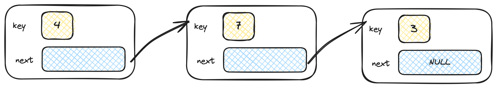
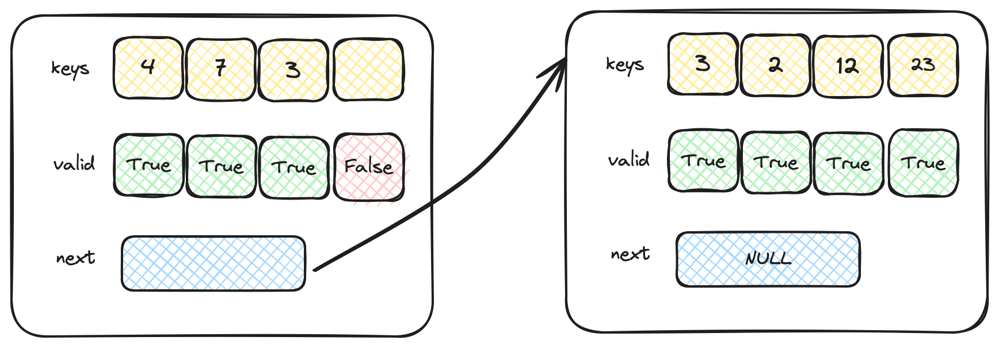

<style>
body {background: #fff; color: #000;}
code {background: #fff; color: #990;}
</style>

# Esercitazione 03

_21 Ottobre 2024_

Lo scopo di questa esercitazione è vedere come strutture dati, in cui la ricerca ha asintoticamente la stessa complessità, possono avere performance differenti per una serie di motivi che vanno dal numero diverso di istruzioni eseguite alla maggiore località di memoria.

In particolare in questa esercitazione si vogliono confrontare le liste concatenate singole (_linked lists_) con una versione chiamata _unrolled linked lists_ (o liste concatenate "srotolate").

Viene fornita l'implementazione di una lista concatenata semplice in ``linked_list.c``, la cui interfaccia è presentata nel file header ``linked_list.h``. In particolare sono implementate le funzioni per:

1. creare una lista concatenata (```lst_make```);
2. eliminare una lista e tutto il suo contenuto (```lst_delete```);
3. inserire un elemento in testa alla lista (```lst_add```);
4. cercare se un elemento è presente nella lista (```lst_search```);
5. stampare il contenuto dell'intera lista (```lst_print```).

Una lista concatenata "srotolata" si comporta come una lista concatenata "normale" ma ogni nodo può contenere fino a $k$ valori. Questo permette di mantenere localmente vicini in memoria più valori della lista. Un confronto tra le due strutture è visibile in figura.

_Linked list:_


_Unrolled linked list:_


Si vuole che venga implementata una lista concatenata "srotolata" con l'interfaccia come definita dal file ```unrolled_linked_list.h``` e venga comparato il tempo necessario alla ricerca di un elemento per dimensioni della lista fino a $10^8$ elementi. Dato che entrambe le strutture dati richiedono una scansione lineare degli elementi, la complessità è $O(n)$ con $n$ il numero di elementi contenuti. Perché il tempo di esecuzione è differente?

### Dettagli del funzionamento di una _unrolled linked list_

Ogni nodo della lista srotolata ha due array:
1. un array ```keys``` di valori contenuti nella lista;
2. un array di valori Booleani che indica quali dei valori di ```keys``` sono validi e quali no.

#### Inserimento

Quando si inserisce un nuovo valore nella lista vi sono quindi due possibilità:
1. Se il nodo in testa alla lista ha ancora posto in ```keys``` è possibile inserire direttamente l'elemento nell'array senza compiere ulteriori allocazioni. Si ricorda che un posto è considerato libero se il valore Booleano ad esso associato è ```false``` (i.e., non vi è un valore valido contenuto in quella posizione dell'array). Non è importante l'ordine in cui la chiave viene inserita.
2. Se il nodo in testa alla lista non ha più posto è necessario allocare un nuovo nodo da inserire in testa alla lista.

#### Ricerca

La ricerca in una lista srotolata richiede di svolgere una ricerca in due fasi:
1. All'interno del nodo con una scansione lineare dell'array (ma tenendo conto del fatto che un valore deve essere valido per venire considerato).
2. Cercando nel nodo successivo se il nodo attuale non contiene il valore cercato.

### Note aggiuntive

Vengono fornite delle funzioni per testare il funzionamento della lista concatenata (srotolata e non) e altre per testare il tempo richiesto a effettuare la ricerca.

### Extra

Si implementi per ciascuna delle due tipologie di liste una funzione che rimuova dalla lista la prima occorrenza del valore richiesto, se presente. Si aggiungano le loro dichiarazioni ai rispettivi file header, con signature:

```void lst_remove(linked_list lst, int key)```

```void ulst_remove(unrolled_linked_list lst, int key)```

Si provino tali funzioni modificando ```test_linked_list``` e ```test_unrolled_linked_list``` nel file ``main.c``.