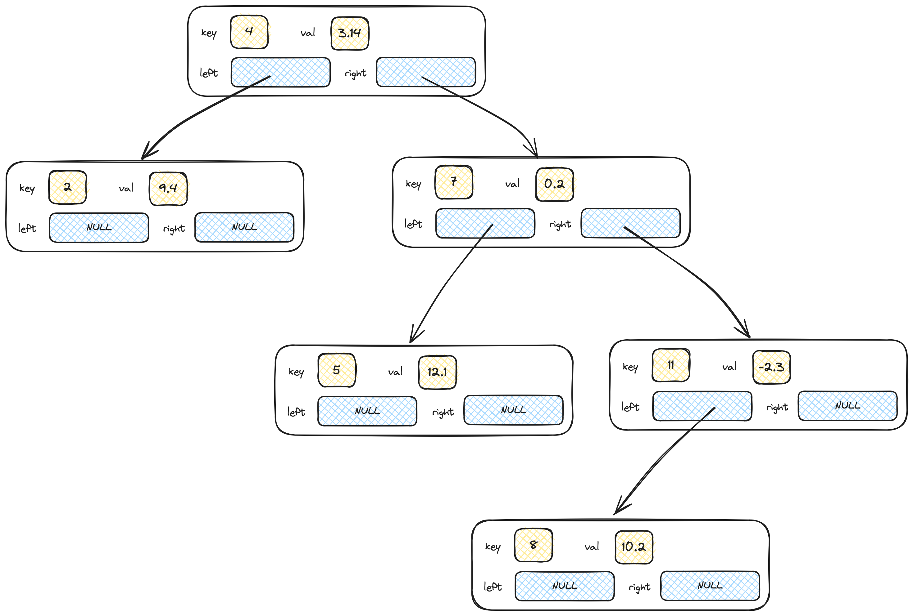
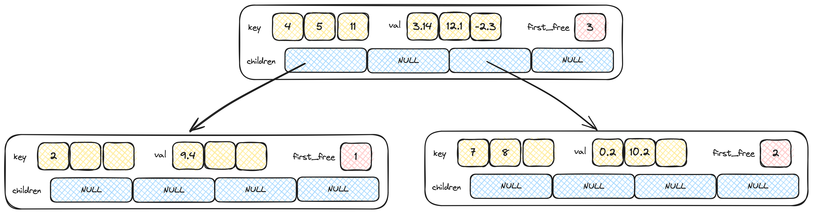

<style>
body {background: #fff; color: #000;}
code {background: #fff; color: #990;}
</style>

# Esercitazione 04

_28 Ottobre 2024_

Lo scopo di questa esercitazione è quello di vedere l'effetto di utilizzare un _fanout_ (numero di figli) maggiore negli alberi di ricerca usati per implementare una mappa (o array associativo, come i ```dict``` in Python) che nel nostro esempio associa a un intero un valore float. Questa non è certamente l'unica opzione possibile di implementazione di un array associativo (altre opzioni possibili sono, per esempio, le tabelle hash).

Si ricorda che ogni nodo di un albero binario di ricerca è fatto in modo da avere un contenuto (nel nostro caso una chiave e un valore) e due puntatori rispettivamente al sottoalbero sinistro e al sottoalbero destro, col primo che conterrà chiavi minori di quella nel nodo e il sinistro chiavi maggiori.

<figure>

<figcaption>Figura 1: Un esempio di albero binario di ricerca usato per implementare una mappa con chiavi intere e valori float.</figcaption>
</figure>

L'albero binario che trovate già implementato può usare le seguenti funzioni:

- ```tree insert(tree t, int key, float val)```. Inserisce nell'albero ```t``` la chiave ```key``` con associato il valore ```val```, se la chiave esisteva già nell'albero ne sostituisce il valore associato con quello nuovo. Viene ritornato l'albero modificato. Dato che ```NULL``` è un albero valido (quello vuoto), per inserire il primo valore sarà sufficiente passare ```NULL``` come primo argomento.
- ``bool search(tree t, int key, float * val)``. Cerca la chiave ```key``` nell'albero ```t```, ritornando ```true``` se la chiave esiste e ```false``` altrimenti. Nel caso la chiave esista, il valore puntato da ```val``` viene sostituito con il valore corrispondente alla chiave cercata, altrimenti esso rimane invariato.
- ```void print_tree(tree t)```. Stampa l'albero. L'albero nella figura d'esempio sarebbe stampato come ```((. 2 .) 4 ((. 5 .) 7 ((. 8 .) 11 .)))```, dove ```.``` rappresenta un puntatore ```NULL``` (i.e., sottoalbero vuoto).

Si vuole implementare un albero con un numero maggiore di chiavi per nodo (indicativamente $n \ge 1$) e un numero maggiore di figli (necessariamente $n+1$).

Ogni nodo contiene $k_0, \ldots, k_\ell$ chiavi distinte con $\ell \le n-1$ ordinate in ordine crescente, quindi $k_0 < k_1 < k_2 < \ldots < k_\ell$. Ogni nodo con meno di $n$ chiavi non avrà figli, quando diventa necessario inserire una nuova chiave si inserisce direttamente nel nodo spostando le altre in modo da mantenere l'ordine crescente. Quindi al momento dell'inserimento della chiave $8$ in un nodo che può contenere al massimo $n = 4$ chiavi e attualmente contiene le chiavi $4$, $7$ e $11$, _non_ verrà creato un nuovo figlio ma il valore verrà direttamente inserito nel nodo, che quindi conterrà le chiavi nell'ordine $4$, $7$, $8$ e $11$.

Nel caso, invece, un nodo contenga già $n$ chiavi, esso potrà avere fino a $n+1$ sottoalberi figli $T_0, \ldots, T_n$ dove il sottoalbero $T_i$ con $1 \le i \le n-1$ conterrà le chiavi di valore compreso tra $k_{i-1}$ e $k_i$. Il sottoalbero $T_0$ conterrà le chiavi con valore minore di $k_0$ (e quindi di tutte le chiavi del nodo essendo $k_0$ quella minima) e $T_n$ le chiavi con valore maggiore di $k_{n-1}$ (e quindi di tutte le chiavi del nodo essendo $k_{n-1}$ quella massima). Un esempio è presentato nella seconda figura.

Viene richiesto di implementare le seguenti tre funzioni:

- ```ctree cinsert(ctree t, int key, float val)```. Inserisce nell'albero ```t``` la chiave ```key``` con associato il valore ```val```, se la chiave esisteva già nell'albero ne sostituisce il valore associato con quello nuovo. Viene ritornato l'albero modificato. Dato che ```NULL``` è un albero valido (quello vuoto), per inserire il primo valore sarà sufficiente passare ```NULL``` come primo argomento.
- ``bool csearch(ctree t, int key, float * val)``. Cerca la chiave ```key``` nell'albero ```t```, ritornando ```true``` se la chiave esiste e ```false``` altrimenti. Nel caso la chiave esista, il valore puntato da ```val``` viene sostituito con il valore corrispondente alla chiave cercata, altrimenti esso rimane invariato.
- ```void print_ctree(ctree t)```. Stampa l'albero. L'albero nella figura d'esempio sarebbe stampato come ```((. 2 .) 4 . 5 (. 7 . 8 .) 11 .)```, dove ```.``` rappresenta un puntatore ```NULL``` (i.e., sottoalbero vuoto).

<figure>

<figcaption>Figura 2: Un esempio di albero <i>n</i>-ario di ricerca usato per implementare una mappa con chiavi intere e valori float.</figcaption>
</figure>

Alcune note di implementazione:
- Ogni nodo conterrà un array di chiavi, uno di valori e uno di puntatori. Serve tenere traccia (con ```first_free```) del numero di elementi che abbiamo inserito nel nodo. Finché questo valore è minore di ```N``` (definito in ```ctree.h```) una nuova chiave è inseribile direttamente nel nodo, senza dover allocare nuovi nodi.
- L'inserimento in un sottoalbero avviene solo quando abbiamo già ```N``` chiavi nel nodo. In quel caso bisogna trovare la posizione ```i``` della prima chiave del nodo maggiore di quella che dobbiamo inserire. Questo ci darà l'indice nell'array di puntatori del sottoalbero in cui dobbiamo fare l'inserimento.

### Funzioni di supporto

Sono fornite delle funzioni per stampare gli alberi durante l'inserimento e per verificare come si comportino per la ricerca su grandi quantità di dati:

- ```test_tree``` e ```test_ctree``` sono utili per verificare il funzionamento. Inseriscono ```n``` (l'argomento) elementi nell'albero e fanno una ricerca dei numeri da $0$ a $n-1$.
- ```benchmark_tree``` e ```benchmark_ctree``` inseriscono ```n``` valori nell'albero e svolgono ```repetitions``` ricerche, riportando il tempo totale necessario a svolgere queste ultime.

### Motivazione

Alberi con fanout più elevato (e con altri accorgimenti per mantenere il bilanciamento) sono spesso usati perché hanno una buona località di memoria e anche per implementare strutture dati che lavorino con memoria di massa (si vedano, per esempio i B-tree).