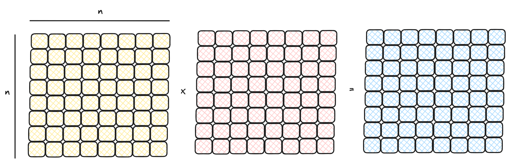
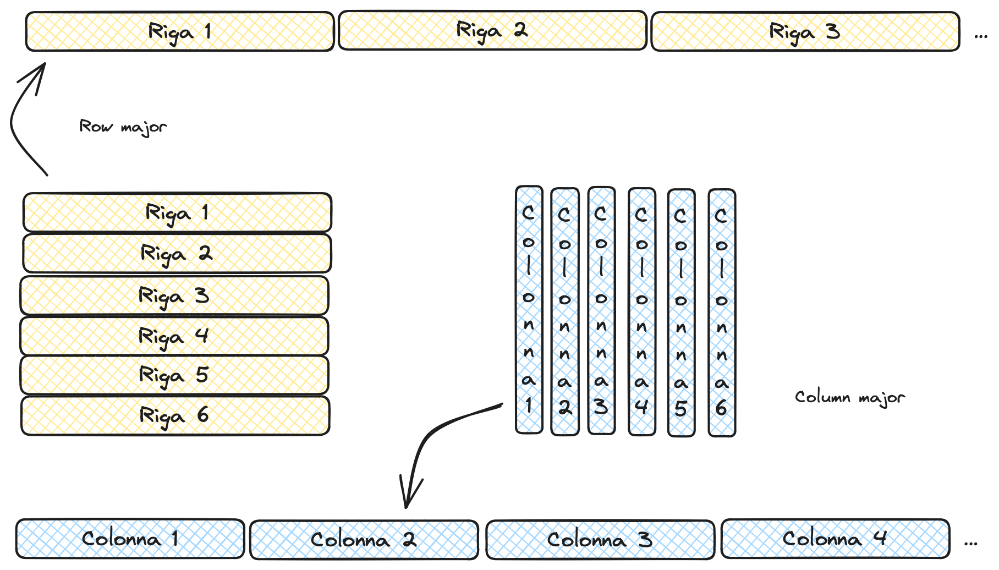
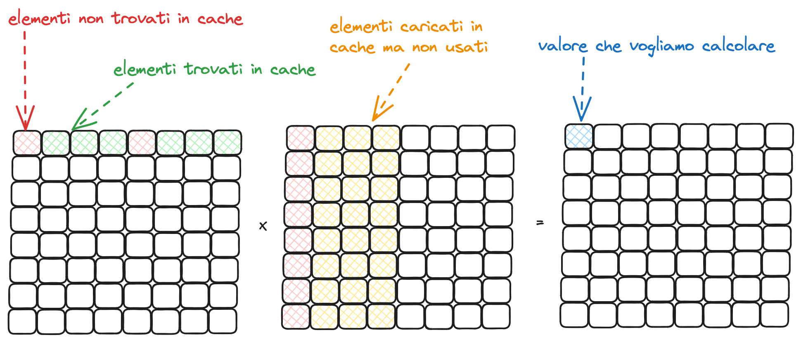
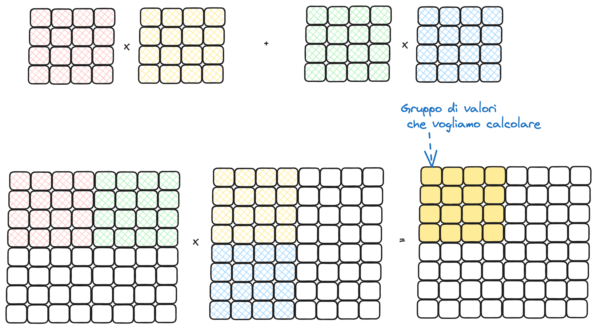

<style>
body {background: #fff; color: #000;}
code {background: #fff; color: #990;}
</style>

# Esercitazione 05

_4 Novembre 2024_

Lo scopo di questa esercitazione è quello di implementare diverse varianti della moltiplicazione di matrici tenendo conto della località di memoria. In particolare si vedrà come moltiplicare due matrici $n \times n$, nel nostro caso di numeri floating point a precisione singola (```float```).

<figure>

<figcaption>Figura 1: Moltiplicazione di matrici.</figcaption>
</figure>

Si assume che le matrici siano rappresentate in modo contiguo in memoria (i.e., un singolo vettore) riga per riga (i.e., rappresentazione _row major_). Ne segue che l'elemento in posizione $i,j$ di una matrice $M$ di $n$ righe e $n$ colonne sarà ```M[i * n + j]```.

<figure>

<figcaption>Figura 2: Rappresentazione per righe e per colonne.</figcaption>
</figure>

<figure>

<figcaption>Figura 3: Effetto sulla cache dell'implementazione "naive" della moltiplicazione di matrici.</figcaption>
</figure>

Le funzioni da implementare sono tre (di cui la prima è già implementata):

1. Nel primo caso si vuole la semplice moltiplicazione righe per colonne (```simple_multiply```). Questa è già implementata e fornisce una baseline per i successivi due metodi

2. Nel secondo caso si consideri il fatto che accediamo alla seconda matrice colonna per colonna, ma con una rappresentazione row major abbiamo i valori delle righe che sono consecutivi in memoria, non quelli delle colonne. Pertanto sarebbe meglio cambiare la rappresentazione della seconda matrice in forma _column major_ (si veda Figura 2), ovvero dove i dati sono memorizzati in modo che i valori di ciascuna colonna siano consecutivi. Tale trasformazione è già implementata in ```matrix.c``` ed usata in ```main.c```. Si implementi quindi la moltiplicazione righe per colonne di due matrici in cui la prima è in forma row major e la seconda in forma column major (```transposed_multiply```).

3. Infine si implementi una moltiplicazione a blocchi di due matrici (```blocked_multiply```) nuovamente assumendo che la prima sia in forma row major e la seconda in forma column major. In questo caso le due matrici che vogliamo moltiplicare (chiamiamole $A$ e $B$) sono divise in blocchi di dimensione fissata e possiamo riscrivere il risultato della moltiplicazione come somma di moltiplicazioni di questi blocchi. Formalmente:

    $$\begin{bmatrix}A_{1,1} & A_{1,2}\\\ A_{2,1} & A_{2,2}\end{bmatrix} \times \begin{bmatrix}B_{1,1} & B_{1,2}\\\ B_{2,1} & B_{2,2}\end{bmatrix} = \begin{bmatrix}C_{1,1} & C_{1,2}\\\ C_{2,1} & C_{2,2}\end{bmatrix}$$

    Ad esempio $C_{1,1}$ può venire calcolato come $A_{1,1} \times B_{1,1} + A_{1,2} \times B_{2,1}$. In pratica l'effetto sarebbe quello di avere una funzione per calcolare la moltiplicazione di due "blocchi" mettendo il risultato in $C$ e iterando sulle matrici $A$ e $B$ blocco per blocco. Il vantaggio sarebbe quello che ciascuna di quelle moltiplicazioni può essere fatta su matrici abbastanza piccole da stare in cache. In pseudocodice ciò prenderebbe la seguente forma:

    ```for i = 1 to n with step s1```</br>
    &emsp;```for j = 1 to n with step s2```</br>
    &emsp;&emsp;```for k = 1 to n with step s3```</br>
    &emsp;&emsp;&emsp;```TMP =  matmul(A[i:i+s1, k:k+s3], B[k:k+s3, j:j+s2])```</br>
    &emsp;&emsp;&emsp;```C[i:i+s1, j:j+s2] = C[i:i+s1, j:j+s2] + TMP```

    dove i blocchi di $A$ sono $s1 \times s3$ e quelli di $B$ sono $s3 \times s2$, risultando in blocchi $s1 \times s2$ di $C$. Per fare questo è utile implementare una funzione di supporto a cui passare le tre matrici $A$, $B$ e $C$ ma in cui viene chiesto di fare la moltiplicazione solo per un certo range di righe e colonne date dagli indici $i$, $j$, $k$ come punto di partenza e dai tre parametri $s1$, $s2$ e $s3$. Una signature della funzione da implementare è presente in ```matrix_multiply.c``` con il nome ```kernel```. Un esempio di moltiplicazione "a blocchi" è dato in Figura 4.

<figure>

<figcaption>Figura 4: Moltiplicazione a blocchi: come moltiplicazione normale ma usando un "blocco" come componente di base.</figcaption>
</figure>

#### Suggerimenti

- Controllate che le moltiplicazioni di matrici che implementate siano corrette, viene fornito un metodo per stampare le matrici, provate a vedere che la moltiplicazione "naive" e quella che implementate voi corrispondano!
- Quando accedete a una matrice in forma column major ricordate che il calcolo dell'indice corretto è diverso da quello per la forma row major.
- Verificate come cambiano le prestazioni al variare di $s1$, $s2$ e $s3$ (i.e., la dimensione dei blocchi).