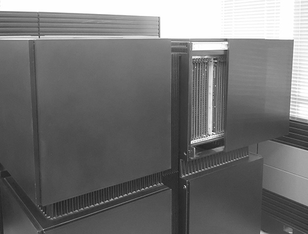
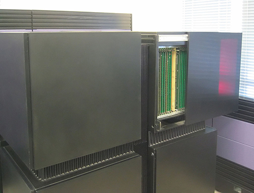

# Esercitazione 06

_11 Novembre 2024_

Lo scopo di questa esercitazione è quello di familiarizzare con i diversi metodi di input/output forniti dal linguaggio C. In particolare si vuole creare un sistema per leggere e modificare un formato di immagine molto semplice (netpbm in scala di grigi).

### Struttura dei file netpbm

I file netpbm sono un formato molto semplice (e poco efficiente) per memorizzare immagini. Nel caso particolare di rappresentazione in scala di grigi coi dati immagine in binario il file inizia con la seguente intestazione _in forma testuale_:

```
P5
1007 768
255
```

Dove ```P5``` indica il formato, ```1007``` e ```768``` indicano larghezza e altezza dell'immagine in pixel e ```255``` il valore massimo raggiungibile per l'intensità di un pixel. Questo significa che ogni pixel è salvato come un'intensità (intera) tra $0$ e $255$ occupando un byte.
Immediatamente dopo il ritorno a capo che segue il ```255``` seguono $1007 \times 768$ byte ognuno rappresentante un pixel. I pixel sono salvati riga per riga con il primo di coordinate $(0,0)$ in alto a sinistra e l'ultimo $(\text{width}-1, \text{height}-1)$ in basso a destra nell'immagine.

### Struttura per accedere ai file netpbm

```
struct _netpbm_image {
  int width;
  int height;
  int offset;
  int size;
  FILE * fd;
  char * data;
};
```

In questa struttura:

- ```width``` e ```height``` sono le dimensioni dell'immagine in termini di numero di pixel orizzontali e verticali.
- ```offset``` indica in quale punto del file (in byte) iniziano i dati dell'immagine (i.e., la prima posizione dopo l'intestazione del file).
- ```size``` indica la dimensione totale del file in byte.
- ```fd``` serve a tenere traccia del file da cui è stata letta l'immagine.
- ```data``` è un puntatore ai dati dell'immagine. In particolare negli indici da ```0``` a ```offset-1``` sarà contenuta l'intestazione e successivamente (da ```offset``` a ```size-1```) i pixel dell'immagine memorizzati riga per riga. Ne segue che il pixel della riga $y$ e colonna $x$ sarà all'indice ```y * width + x + offset```.

### Funzioni da implementare

Lo scopo del progetto è quello di implementare una serie di funzioni che permettano di rendere funzionante il contenuto del file ```main.c``` che legge un'immagine in formato netpbm in scala di grigi  (indicato dall'estensione _.pgm_) e salva una sua copia modificata. Per fare questo sono necessarie le seguenti funzioni nel file ```netpbm.c```:

- ```int open_image(char * path, netpbm_ptr img);``` apre una immagine popolando la struttura puntata da ```img``` passato come argomento. Si suggerisce di ottenere le dimensioni dell'immagine (altezza e larghezza) nonché quelle del file e l'offset usando le funzioni ```fscanf```, ```ftell``` e ```stat```. Si può poi procedere a mappare in memoria il file impostando correttamente il puntatore ```data```. Deve ritornare un valore negativo in caso di errore e zero in caso di successo.

- ```int empty_image(char * path, netpbm_ptr img, int width, int height);``` viene già fornita ed è implementata in modo da usare ```open_image```. Come nel caso precedente ritornerà un valore negativo in caso di errore e $0$ in caso di successo.

- ```char * pixel_at(netpbm_ptr img, int x, int y);``` restituisce un puntatore al pixel in posizione $(x,y)$ nell'immagine passata come argomento. Il puntatore ritornato deve essere ```NULL``` se il pixel richiesto supera i limiti dell'immagine.

- ```int close_image(netpbm_ptr img);``` chiude l'immagine (toglie la mappatura in memoria e chiude il file associato).

<br>

### Immagine d'esempio fornita

_Formato netpbm in scala di grigi (CM1.pgm):_



<br>

_Originale:_

