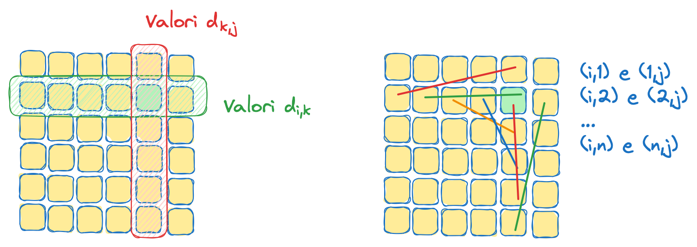

# Esercitazione 07

_18 Novembre 2024_

Lo scopo di questa esercitazione è la scrittura di un programma che calcola la "scorciatoia" in un grafo diretto pesato. Si supponga di avere una matrice $d$ di dimensioni $n \times n$  di valori reali positivi (nel codice saranno rappresentati con il tipo ```float```) con la diagonale di zeri. Questa può essere interpretata come la matrice dei pesi di un grafo diretto di $n$ nodi, dove l'elemento $d_{i,j}$ indica il peso dell'arco dal nodo $i$ al nodo $j$, o zero se $i=j$.

Si vuole definire una matrice $m$, sempre di dimensioni $n \times n$, nel seguente modo: per ogni $1 \le i,j \le n$ si ha che
$$m_{i,j} = \min_{1 \le k \le n} d_{i,k} + d_{k,j}$$

In pratica stiamo chiedendo di trovare il percorso minimo tra i nodi $i$ e $j$ passando esattamente per un altro nodo $k$ (non necessariamente distinto da $i$ e $j$). Si vuole scrivere una funzione che, data una matrice $d$, riempia i valori della matrice $m$ come da definizione. Per fare questo sarà necessario, per ogni posizione $m_{i,j}$ di $m$ confrontare $n$ diverse somme di coppie di valori della matrice $d$ per trovarne il minimo: $d_{i,1} + d_{1,j}$, $d_{i,2} + d_{2,j}$, $\ldots$, $d_{i,n} + d_{n,j}$

<figure>

<figcaption>Figura 1: Un esempio dei valori della matrice <i>d</i> a cui accediamo per calcolare <i>m<sub>i,j</sub></i>. A destra gli elementi a cui accediamo al variare di <i>k</i>.</figcaption>
</figure>

### Funzioni da definire

Nel file ```graph.c``` sono da definire le seguenti funzioni:

```void shortcut_std(float * m, float * d, int n)```

Riempie i valori della matrice ```m``` a partire da quelli contenuti nella matrice ```d``` (le due matrici hanno dimensione $n \times n$). In questa implementazione si applichi direttamente la definizione (i.e., iterare su tutte le posizioni di ```m``` e, per ognuna, iterare sugli $n$ valori possibili di $k$ per trovare la somma minima dei valori in ```d```).

```void shortcut_trs(float * m, float * d, int n)```

Possiamo notare che la matrice ```d``` viene acceduta sia per righe (efficiente) che per colonne (meno efficiente). Potrebbe essere utile creare una copia trasposta ```t``` di ```d``` e computare i valori di ```m```, similmente a prima, accedendo per righe sia in ```d``` che in ```t```. Ricordatevi di deallocare ```t``` alla fine della funzione.

```void shortcut_omp(float * m, float * d, int n)```

In questo caso dovete prendere il codice di ```shortcut_std``` e renderlo parallelo con OpenMP.

```void shortcut(float * m, float * d, int n)```

In questa funzione ogni ottimizzazione è consentita (ma misurate dopo aver implementato). Potreste iniziare parallelizzando il codice di ```shortcut_trs```.

### Funzioni già definite

In ```matrix.c```:

```float * random_matrix(int n)```

Ritorna una matrice quadrata di lato $n$ di valori casuali positivi in cui la diagonale principale è composta da zeri. La matrice è rappresentata in modo contiguo in memoria in forma row major.

```float * zero_matrix(int n)```

Ritorna una matrice quadrata di lato $n$ in cui tutti i valori sono zero. La matrice è rappresentata in modo contiguo in memoria in forma row major.

In ```main.c```:

```double test_shortcut(void (*f) (float*, float*, int), float* m, float* d, int n, int r)```

Esegue per un numero di ripetizioni ```r``` la funzione ```f``` per il calcolo degli shortcut su una matrice $n \times n$, ritornando il tempo medio.

### Note

- La funzione "base" ```shortcut_std``` può essere fatta semplicemente innestando tre cicli for (iterando su $i$, $j$ e $k$). Notate che dovremo stabilire un valore iniziale per $m_{i,j}$, alcune scelte possibili sono $d_{i,j}$ (dato che $d_{i,j} = d_{i,j} + d_{j,j}$, quindi è un valido candidato per essere il minimo) oppure $+\infty$, che in C è ottenibile importando ```math.h``` e usando la costante ```INFINITY```.

- Precedentemente nelle definizioni delle matrici $d$ e $m$ sono stati usati gli indici $1, \ldots, n$, mentre nel codice avremo gli indici $0, \ldots, n{-}1$.

- Nel main usiamo la funzione ```omp_get_wtime()``` che ritorna il tempo passato da un momento iniziale in secondi (rappresentato come ```double```, quindi anche le frazioni di secondo sono presenti). Questo è il "wall clock time", ovvero il tempo effettivamente passato "guardando un orologio". Potenzialmente possiamo contare il totale del tempo di ogni thread. Questo risulterà maggiore nel caso di programmi con più thread dato che, per esempio, il wall clock time di $10$ thread che, in parallelo, eseguono per $1$ secondo è di $1$ secondo, mentre il totale del tempo speso dai thread è $10$ secondi (i.e., il tempo per eseguire i thread sequenzialmente uno alla volta). Nel nostro caso ci interessa il tempo effettivamente passato.